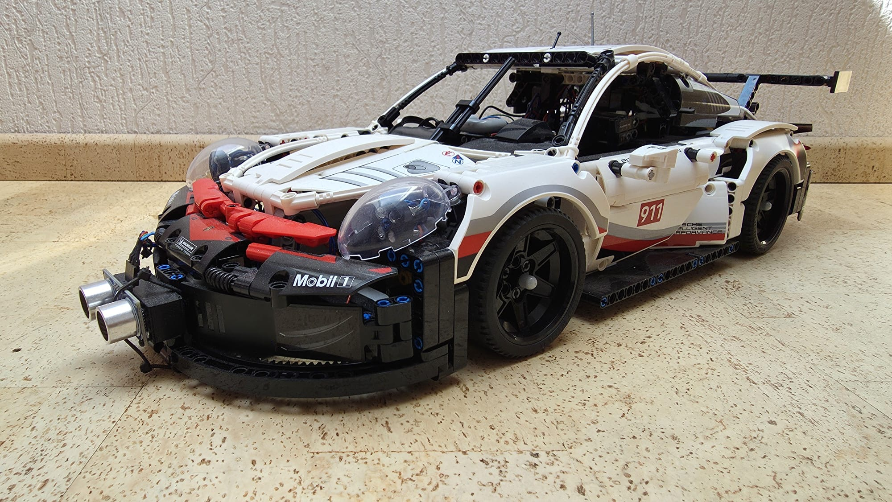
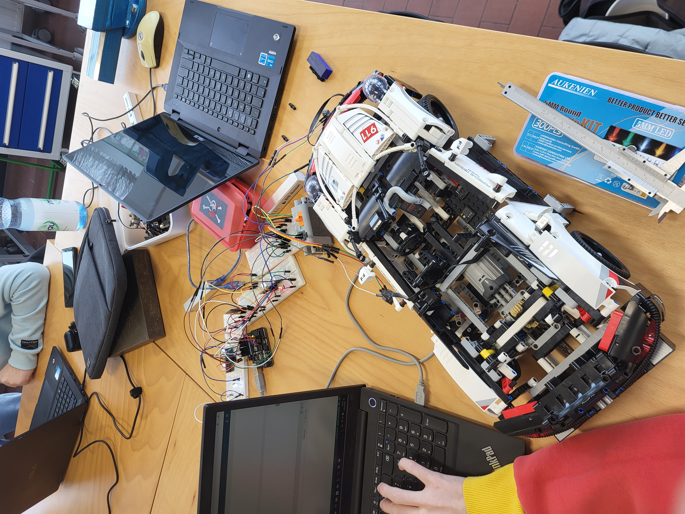
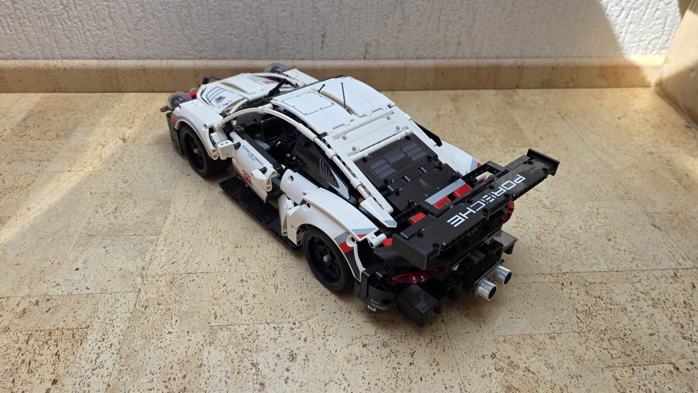
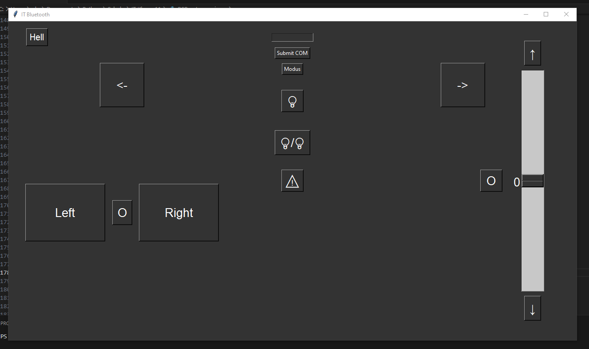

# LegoRSR
Ich habe mit einem Freund, für ein Schulprojekt, einen Lego Porsche umgebaut.

Die Aufgabe war es ein fahrbares Objekt zu bauen, dass auf eine Wand zufährt, erkennt, langsamer wird, stehen bleibt und rückwärts wieder wegfährt.

Also haben wir meinen Lego Porsche genommen und angefangen.

Ich habe einen Schaltplan entwickelt um die Hauptanforderungen zu erfüllen. Nachdem das geschehen war, wollten wir aber nicht aufhören und haben uns neue Sachen überlegt die wir hinzufügen wollten.

Also erstellte ich noch eine Software zum fernsteuern, damit konnte man Lichter einschalten, Warnblinker und Blinker steuern, Geschwindigkeit einstellen und lenken.

Als dann noch Zeit war implementierte ich auch noch ein SSD1306 Display und über einen ESP32-CAM eine Kamera im Innenraum.

Die Verbindung zwischen Software und Arduino lief über Bluetooth und die Kamera lief über einen Webserver auf dem ESP32, wo ich in der Software dann den Stream abgefangen habe.

